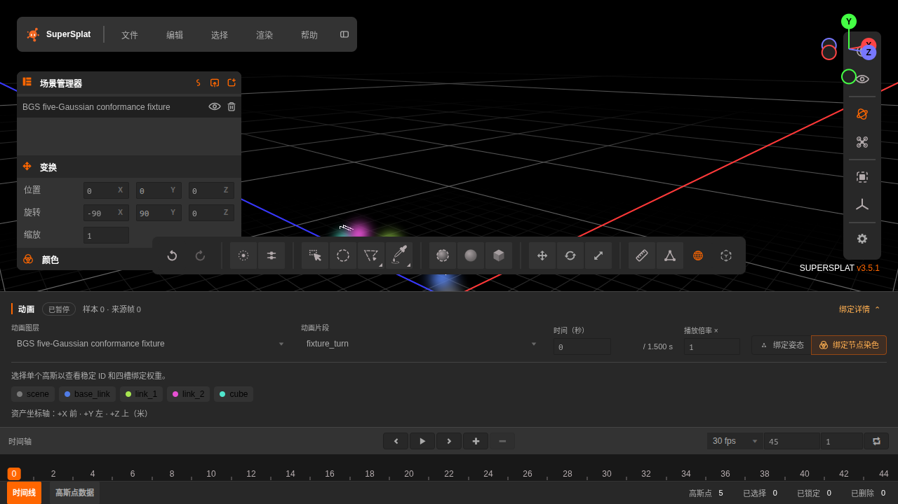
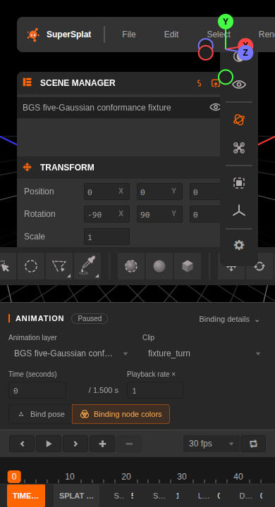
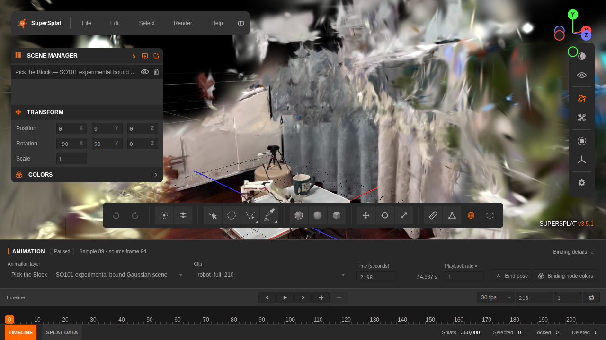

# 动画交付验收记录

日期：2026-10-05（北京时间）。基于 SuperSplat 3.5.1；最终功能提交
`0c1ffc5`（界面）与 `80a070f`（捕获保护），`5425a43` 保存验收证据，
`4adbeae` 修复 CI 的完整软件渲染路径并增加画布预检。
真实输入与合成压力场景分别测试，不互相替代。

## 验证结果

| 项目 | 结果与证据 |
| --- | --- |
| 工程 | TypeScript 类型检查、完整 `src` lint、生产构建通过；9 种语言均为 410 个键；19 项 TypeScript 单元测试通过 |
| 外部参考 | 原始 Python 数学测试 5/5、JavaScript reference-player 自检通过 |
| 真实输入 | 350,000 高斯、10 节点、2 片段、359 样本；独立 Python 验证与 6 文件哈希清单通过：[记录](acceptance/real-input-validation.json) |
| 实际 GPU 浏览器 | 20/20 通过，约 2.1 分钟；包含两个真实场景测试、两个独立压力/性能测试 |
| 软件 WebGPU | 最终完整配置 17/17 通过（约 4.2 分钟），4 项真实/性能检查明确跳过；包含设备/画布预检与 PNG 截图 |
| 界面 | PCUI 原生灰黑/橙色样式、字段标签、播放状态、样本/来源帧、折叠四槽检查器、稳定节点图例；中文切换保留图标；Enter 展开及 pressed 状态；1280/640/390px 无动画面板横向溢出 |
| 编辑 | 非绑定姿态仿射编辑后播放、撤销/重做、复制、分离、删除/恢复、锁定/解锁；共享资源与独立实例状态保持 |
| 数据与工具 | 变形后的直方图/协方差、框选、屏幕掩码选择、深度/足迹组合、球/盒体积、球刷、颜色选择；真实指针测量与定向；动画开始编辑时暂停 |
| 显示模式 | 高斯、中心、环、选择轮廓、Overdraw 与绑定染色组合无 GPU/浏览器错误；深度拾取使用当前姿态 |
| 项目 | 动画 v2 保存重载保留时间/倍率/预览/编辑/共享关系；构造的 v0/v1 静态历史项目保持摆放与时间轴 |
| 静态导出 | PLY 快照均值/完整仿射协方差对照；SPLAT、压缩 PLY、SPZ3/4、SOG 再导入均值对照；非均匀整体图层 SH 放置明确拒绝 |
| BGS 导出 | 四槽绑定、稳定 ID、节点/片段、SH 与未知 double/uchar 属性；重排、剪切与颜色编辑后回导验证；重新生成资产 ID、验证与哈希清单 |
| 捕获与生命周期 | PNG 当前时间求值；视频准确帧时间与视口姿态恢复；100 次快速 seek 跨图层只发布最新请求；失败保持有效姿态；晚到导入取消、重复导入释放、清空取消视频并解除控件/快捷键锁 |

屏幕掩码测试验证套索/刷选共用的选择计算入口；并非覆盖每种鼠标轨迹的
视觉快照。显示模式检查证明变形后可以渲染且无错误，不等同于每个像素的
自动视觉基准。截图与视频测试验证求值时序、成功输出及状态释放，没有
逐像素验证所有编码器、360 投影和所有浏览器实现。

### 精度分开记录

- CPU：双精度数学测试与独立 JS oracle 比较 DQ、层级、插值与均值，
  默认绝对容差 `1e-8`；覆盖符号对齐、确定性 fallback、端点与协方差。
- GPU 变形：5 点合成最大矩阵绝对误差 `2.2322e-8`；真实数据在两个
  片段各抽样 352 行，合计 704 个矩阵，最大误差 `8.4005e-8`。
- 真实编辑：8 个有绑定高斯的非静态节点，包括 cube；非绑定时间进行
  平移、旋转及非均匀缩放，然后在两个片段比较，最大矩阵误差
  `1.1921e-7`。节点 7 没有绑定高斯，未伪造该节点的编辑证据。
- GPU 压缩属性：剪切后的协方差查询最大相对误差 `1.60411e-5`（实际
  GPU）、`1.59573e-5`（SwiftShader），相对于矩阵最大绝对分量归一化。
  不能用 CPU 容差描述压缩后的 GPU 画面。
- 压缩静态格式仅在 5 点合成样例对照均值，测试容差为 `0.005` 编辑器
  单位。没有声称有损格式在真实场景满足无损的协方差或 SH 容差。

真实编辑子集导出后再次通过独立参考验证：[8 点记录](acceptance/real-subset-export-validation.json)。
5 点合成导出也单独验证：[记录](acceptance/conformance-export-validation.json)。
真实项目保存/重载为 3 层、350,008 个实例；原场景与分离出的编辑子集
共享资源，回导的独立资产保留这 8 个稳定 ID。

## 1080p 性能

环境：Linux 7.0.0-30-generic、Node 22.23.2、Playwright 1.63.0、
Chromium 153.0.8010.12、WebGPU Vulkan。浏览器报告 GPU vendor `nvidia`、
architecture `lovelace`，device/description 为空，因此不指称具体显卡型号。

合成资产为 100×100×35 的规则网格，间距 0.025 米、标准差 0.006 米，
从 5 点参考资产继承属性和片段，使用静态根/运动节点硬绑定；不模拟真实
捕获或训练出的软绑定。目标确认为 1920×1080，350,000 实例；采用排序渲染、同一相机，强制
持续刷新。每段预热 1.5 秒后测量 4 秒。静态对照移除动画计算但保留同一
不可变资源、实例数和视角，使用基础姿态，因此投影覆盖与动画姿态不完全
相同。GPU/CPU 中位数与 p95 是编辑器最后最多 180 帧的滚动窗口；
GPU 时间来自 timestamp query。姿态更新率是完整提交的变形帧数，
与重复呈现已有姿态的渲染率分开报告。

| 场景 | 渲染 fps | 完整姿态 fps | GPU 中位 / p95 ms | CPU 中位 / p95 ms |
| --- | ---: | ---: | ---: | ---: |
| 35 万合成，动画 | 59.99 | 47.49 | 11.85 / 15.61 | 2.30 / 3.40 |
| 35 万合成，静态对照 | 60.00 | — | 4.17 / 4.66 | 1.90 / 2.50 |
| 35 万真实，动画 | 60.00 | 44.50 | 11.67 / 16.63 | 2.30 / 3.30 |
| 35 万真实，静态对照 | 59.99 | — | 3.91 / 4.38 | 1.90 / 3.20 |

本机满足 1080p、30 fps 的目标；这是短时间本机基准，不能保证所有 GPU
或长期热稳定性能。软件 WebGPU 用于正确性检查，不用于性能声明。

渲染器已计入/估算的 GPU 工作集：动画约 97.30 MB，静态约 41.22 MB
（十进制）。包括源纹理、实例/调色板、双缓冲矩阵图集、绑定/节点纹理、
投影与排序缓存；其中 radix scratch 为估算。**不是整机实测显存**，未
计入浏览器/驱动开销、所有渲染目标、管线缓存及 CPU 资源。原始记录：
[合成 JSON](acceptance/stress-performance.json)、[真实 JSON](acceptance/real-performance.json)。

## 样例与范围限制

`pick-the-block-20261004` 是真实重建的实验资产，含 `robot_full_210` 与
`pick_prerelease_149`。绑定是 one-hot B（最近网格），没有训练得到的软绑定；
动画不包含释放动作。来源校准为人工、未优化，159 训练帧且没有 held-out
wrist 帧，另有 15 个裁剪检查。应用验收证明可加载、变形、编辑与导出，
不证明重建画质、物理抓取、多视角一致性或绑定的科研质量。

神经网络加载、动态增删高斯拓扑不在本次范围内。泛化 provider 接口已留出
异步准备、取消、释放、能力声明和可选编辑逆映射；新的 provider 仍需
实现相应渲染适配与验证。其他语言新文案为英文 fallback，中文/英文完整。

## 可复现命令

```bash
npm ci
npm run typecheck
npm run lint
npm run lint:locales
npm test
npm run build
npx playwright install chromium
npm run test:stress
BGS_REAL_SAMPLE=/data/zhuyutian/data/bgs/samples/pick-the-block-20261004/ npm run test:browser
```

无真实资产或可用硬件 GPU 的 CI：

```bash
BGS_WEBGPU_SOFTWARE=1 BGS_SKIP_REAL=1 BGS_SKIP_PERF=1 npm run test:browser
```

软件模式显式配置 Dawn 的 SwiftShader 适配器、ANGLE SwiftShader、Chrome
Vulkan SwiftShader 与 GPU raster/2D canvas（由 Playwright 配置提供）。
只有适配器或缓冲区可用不足以证明画布共享图像可用，因此新增画布 clear
及回读预检。配置参考 [Chromium 的 SwiftShader 文档](https://chromium.googlesource.com/chromium/src/+/main/docs/gpu/swiftshader.md)
与 [Chromium 自身的 WebGPU 测试配置](https://chromium.googlesource.com/chromium/src/+/HEAD/third_party/blink/web_tests/FlagSpecificConfig)。
每次浏览器运行覆盖 `test-results/`，其中保留导出 ZIP、项目、截图和
性能 JSON。真实数据以及大型生成压力文件均不提交；压力场景默认生成
在 `.git/bgs-synthetic-stress`，可显式传输出目录。

原始 BGS 参考校验器在外部数据目录：

```bash
python3 -B /data/zhuyutian/data/bgs/reference/test_bgs.py
node /data/zhuyutian/data/bgs/reference/test_reference_player.js
python3 -B /data/zhuyutian/data/bgs/reference/validate.py "$BGS_ASSET_DIR" --verify-manifest
```

GitHub CI 工作流包含构建、类型检查、单元测试、lint/本地化和软件 WebGPU
回归；硬件性能与真实数据验证由本机完成。最终代码提交 `4adbeae` 的远端验证全部通过：
[CI 37221389015](https://github.com/rubatotree/supersplat-anim/actions/runs/37221389015)，
17 项软件浏览器检查通过、4 项明确跳过，约 4.3 分钟。机器可读摘要见
[github-ci.json](acceptance/github-ci.json)。初次运行因画布共享图像初始化
失败而超时，已在本机复现并修正完整软件渲染配置，不将初次运行计作通过。

## 界面证据






